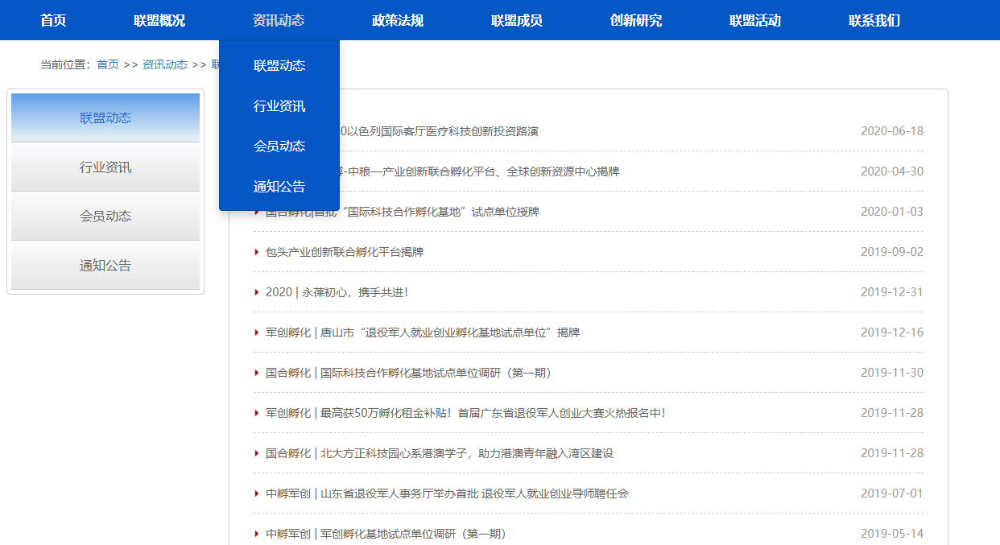
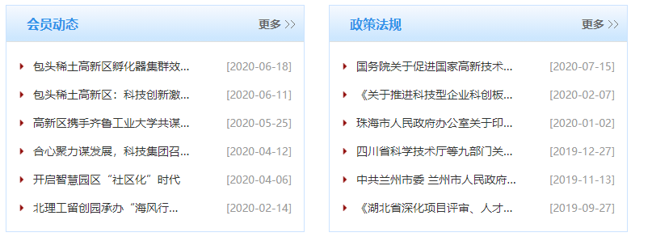

# **孵化器联盟项目说明**

# 系统说明

- 前台应用为移动端
- 后台管理为PC端

## 子系统

1. 用户管理系统
2. 信息发布系统
3. 留言板

## 业务方向

- 主要业务是展示孵化器联盟的各个成员，为成员提供信息及成员发布信息，加深成员与组织间的联系及合作
- 减少组织者的工作量，让基础将具体的内容信息进行发布
- 项目首先明确分三层管理，业务方向是为了减少首层管理的业务量，主要业务分配到第二层完成。

1. 首层孵化器联盟

2. 第二层孵化器

3. 第三层公司

# 实体

被用户操作的所有对象均为“实体”

## 孵化器

包含字段

| 字段       | 数据类型       | 有效值                            |
| ---------- | -------------- | --------------------------------- |
| 唯一编号   | 字符串         |                                   |
| 名称       | 字符串         |                                   |
| 创建日期   | 日期           |                                   |
| 简介       | 字符串         |                                   |
| 地址       | 字符串         |                                   |
| 电话       | 电话           |                                   |
| 联系人     | 字符串         |                                   |
| 邮箱       | 邮箱           |                                   |
| 状态       | 字符串         | 审核中 / 正常 / 停用 / 审核不通过 |
| 创建人     | 字符串         |                                   |
| 主页       | 字符串         | ？？？如：“www.baidu.com”         |
| 公众号名称 | 字符串 或 图片 | ？？？如：公众号二维码            |

## 公司

包含字段

| 字段         | 数据类型 | 有效值               |
| ------------ | -------- | -------------------- |
| 名称         |          |                      |
| 入驻日期     |          |                      |
| 简介         | 字符串   |                      |
| 地址         | 字符串   |                      |
| 电话         | 电话     |                      |
| 联系人       | 字符串   |                      |
| 邮箱         | 邮箱     |                      |
| 状态         | 字符串   | 审核中 / 正常 / 停用 |
| 隶属于孵化器 | 字符串   |                      |
| 创建人       | 字符串   |                      |
| 主页         | 字符串   |                      |
| 公众号名称   | 字符串   |                      |

## 文章

| 字段     | 数据类型 | 有效值 |
| -------- | -------- | ------ |
| 标题     | 字符串   |        |
| 正文     | 字符串   |        |
| 包含附件 | 字符串   |        |
| 作者     | 字符串   |        |
| 文章类型 | 字符串   |        |
| 创建日期 | 日期     |        |
| 修改日期 | 日期     |        |

文章类型

发布的文章类型必须为以下"二级分类"中其一

1. 资讯动态
   1. 公告通知
   2. 活动
   3. 培训
   4. 新闻
   5. 行业动态
   6. 政策法规
2. 创业创新
   1.  创业观察
   2.  创新论坛
   3.  创新大赛
   4.  国际经验
   5.  项目交易

# 业务流程

## 联盟

1. 文章发布：
2. 审核推荐：审核由孵化器推荐的文章，审核通过后与联盟文章同级显示
3. 撤销推荐：撤销已通过推荐审核的孵化器推荐文章

## 孵化器

1. 创建：由任一用户申请创建孵化器，联盟管理员负责审核其填写的信息是否真实，审核通过后，该申请用户获得“孵化器管理员”角色，且该孵化器隶属于该用户
2. 文章发布：
3. 申请推荐：向联盟推荐文章
4. 审核推荐：审核由公司推荐的文章，审核通过后与孵化器文章同级显示
5. 撤销推荐：撤销已通过推荐审核的公司推荐文章

## 公司

1. 创建：由任一用户申请创建公司，联盟管理员负责审核其填写的信息是否真实，审核通过后，该申请用户获得“公司管理员”角色，且该公司隶属于该用户
2. 申请加入某一孵化器：公司管理员向孵化器发出加入申请，孵化器管理员同意后，该公司隶属于该孵化器。
3. 文章发布
4. 申请推荐：向孵化器推荐文章

## 留言板

1. 发布留言
2. 留言审核

# 角色和权限

按照妇幼档案格式写，对每一个实体每一种操作，明确每一个角色有无权限

| 权限           | 联盟管理员 | 联盟管理员次级 | 孵化器管理员 | 孵化器管理员次级 | 公司管理员 | 公司管理员次级 | 注册用户 |
| -------------- | ---------- | -------------- | ------------ | ---------------- | ---------- | -------------- | -------- |
| 审核孵化器信息 | ✓          |                |              |                  |            |                |          |
| 指定次级管理员 | ✓          |                | ✓            |                  | ✓          |                |          |
| 审核公司信息   | ✓          |                |              |                  |            |                |          |
| 审核推荐       | 对孵化器   |                | 对公司       |                  |            |                |          |
| 申请推荐       |            |                | 对联盟       |                  | 对孵化器   |                |          |
| 撤销推荐       | 对孵化器   |                | 对公司       |                  |            |                |          |
| 创建孵化器     |            |                |              |                  |            |                | ✓        |
| 创建公司       |            |                |              |                  |            |                | ✓        |
| 发布文章       | ✓          | ✓              | ✓            | ✓                | ✓          | ✓              |          |
| 发布留言       | ✓          | ✓              | ✓            | ✓                | ✓          | ✓              | ✓        |
| 留言审核       | ✓          | ✓              |              |                  |            |                |          |

# 页面元素

## 导航说明

| 名称     | 说明                                                         |
| -------- | ------------------------------------------------------------ |
| 首页     | 返回首页                                                     |
| 联盟概况 | 二级页选项： 	联盟简介 	组织机构 	联盟章程 	理事会 	秘书处 	入会指南 	联系我们 |
| 资讯动态 | 跳转到 文章列表页的  “/{一级分类}” 或 “/{一级分类}/{二级分类}” |
| 创业创新 | 跳转到 文章列表页的  “/{一级分类}” 或 “/{一级分类}/{二级分类}” |
| 联盟成员 | 进入二级页，左侧为二级导航栏（孵化器 - 公司），右侧为小框文章列表 |

联盟概况参考样式：

二级导航样式参考：

## 主要页面说明

### 联盟成员页

根路由： /联盟成员

左侧为二级导航栏：孵化器 - 公司，右侧为下表“内容”列

| 次级路由         | 内容（每个文章二级分类显示一个小框，小框内为文章列表，每小框限制显示5条，需要“更多”按钮） |
| ---------------- | ------------------------------------------------------------ |
| /                | 显示所有孵化器文章及其下属公司的推荐文章                     |
| /{孵化器}        | 显示该孵化器文章及其下属公司的推荐文章                       |
| /{孵化器}/{公司} | 显示该公司文章（仅使用两个一级分类，每小框限制显示10条）     |
|                  |                                                              |

### 文章列表页

根路由： /文章

左侧为二级导航栏：一级分类 - 二级分类，右侧为下表“内容”列

| 次级路由                               | 内容（按路由给出的过滤条件显示文章列表） |
| -------------------------------------- | ---------------------------------------- |
| /{一级分类}                            | 联盟层级文章列表（联盟+推荐孵化器）      |
| /{一级分类}/{二级分类}                 | 联盟层级文章列表（联盟+推荐孵化器）      |
| /{一级分类}/{二级分类}/{孵化器}        | 孵化器层级文章列表（孵化器+推荐公司）    |
| /{一级分类}/{二级分类}/{孵化器}/{公司} | 公司文章列表                             |

## 

