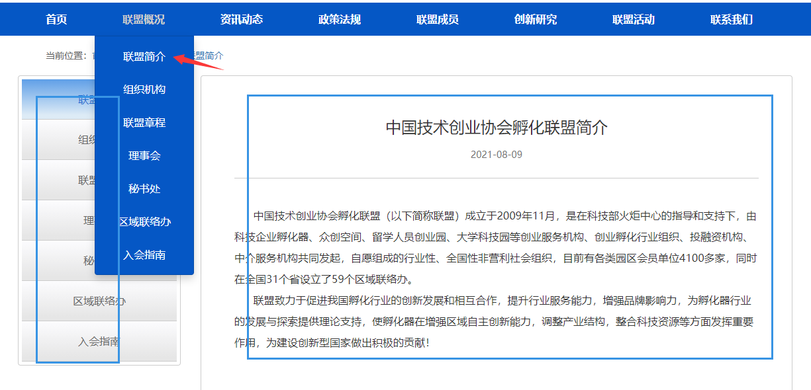

# **孵化器联盟项目说明**

## 子系统

项目分为两个子系统

1. 用户管理系统
2. 信息发布系统
3. 留言板

## 业务方向

- 主要业务是展示孵化器联盟的各个成员，为成员提供信息及成员发布信息，加深成员与组织间的联系及合作
- 减少组织者的工作量，让基础将具体的内容信息进行发布
- 项目首先明确分三层管理，业务方向是为了减少首层管理的业务量，主要业务分配到第二层完成。

1. 首层孵化器联盟

2. 第二层孵化器

3. 第三层公司

   

# 实体

被用户操作的所有对象均为“实体”

## 孵化器

包含字段

| 字段       | 数据类型       | 有效值                    |
| ---------- | -------------- | ------------------------- |
| 唯一编号   | 字符串         |                           |
| 名称       | 字符串         |                           |
| 创建日期   | 日期           |                           |
| 简介       | 字符串         |                           |
| 地址       | 字符串         |                           |
| 电话       | 电话           |                           |
| 联系人     | 字符串         |                           |
| 邮箱       | 邮箱           |                           |
| 主页       | 字符串         | ？？？如：“www.baidu.com” |
| 公众号名称 | 字符串 或 图片 | ？？？如：公众号二维码    |

## 公司

包含字段

| 字段       | 数据类型 | 有效值 |
| ---------- | -------- | ------ |
| 名称       |          |        |
| 入驻日期   |          |        |
| 简介       | 字符串   |        |
| 地址       | 字符串   |        |
| 电话       | 电话     |        |
| 联系人     | 字符串   |        |
| 邮箱       | 邮箱     |        |
| 主页       | 字符串   |        |
| 公众号名称 | 字符串   |        |

## 文章

？？？？？？

| 字段     | 数据类型 | 有效值 |
| -------- | -------- | ------ |
| 标题     | 字符串   |        |
| 正文     | 字符串   |        |
| 包含附件 | 字符串   |        |
| 作者     | 字符串   |        |
| 文章类型 | 字符串   |        |
| 创建日期 | 日期     |        |
| 修改日期 | 日期     |        |

文章分类

发布的文章类型必须为以下"二级分类"中其一

| 一级分类    | 二级分类 |
| :---------- | -------- |
| 资讯动态  > |          |
|             | 公告通知 |
|             | 联盟活动 |
|             | 联盟培训 |
|             | 联盟新闻 |
|             | 行业动态 |
|             | 政策法规 |
| 创业创新 >  |          |
|             | 创业观察 |
|             | 创新论坛 |
|             | 创新大赛 |
|             | 国际经验 |

# 业务流程

？？？？？？

对每一种实体的每一种操作流程、逻辑。特别是增删改查以外的。

# 角色和权限

？？？？？？？？？？？？？？？？？？？？？？

按照妇幼档案格式写，对每一个实体每一种操作，明确每一个角色有无权限

| 权限 | 联盟 | 孵化器 | 公司 | 游客 |
| ---- | ---- | ------ | ---- | ---- |
|      |      |        |      |      |
|      |      |        |      |      |
|      |      |        |      |      |

# 页面元素

## 导航说明

| 名称     | 说明                                                         |
| -------- | ------------------------------------------------------------ |
| 首页     | 返回首页                                                     |
| 联盟概况 | 二级页选项： 	联盟简介 	组织机构 	联盟章程 	理事会 	秘书处 	入会指南 	联系我们 |
| 资讯动态 | 显示 一级分类“资讯动态”下的二级分类导航，点击二级导航展示该分类下的文章列表 |
| 创业创新 | 显示 一级分类“创业创新"下的二级分类导航，点击二级导航展示该分类下的文章列表 |
| 联盟成员 | 进入二级页（二级页为所有孵化器及孵化器下的所有公司列表）      ？？？？？？？？？？？？？？看不懂     “进入联盟下所有孵化器及各孵化器下所有公司列表页面（也是各孵化器和公司文章页面的入口）” |

联盟概况参考样式：

二级导航样式参考：

## 主要页面说明

### 联盟主页

- 主页包含上表的导航，或者按钮，保障上表子项都能通过导航或者按钮进入页面

- 联盟主页包含资讯动态、创业创新下的所有子项进行板块展示

  

- 板块展示为每个子项5条标题列表

- 5条信息为联盟发布的内容（孵化器发布的推荐信息通过审核的视为联盟发布信息）  ？？？？？？？？？？？？ 业务流程里面写清楚“推荐”是什么操作

- 5条信息为时间倒序排列

### 各孵化器页

左侧导航条：

| 一级分类    | 二级分类   |
| :---------- | ---------- |
| 资讯动态  > |            |
|             | 公告通知   |
|             | 孵化器活动 |
|             | 孵化器培训 |
|             | 孵化器新闻 |
|             | 行业动态   |
|             | 政策法规   |
| 创业创新 >  |            |
|             | 创业观察   |
|             | 创新论坛   |
|             | 创新大赛   |
|             | 国际经验   |

- 每个孵化器显示自己的关于孵化器（不等同于关于联盟）  ？？？？？？？？？？？？？？？？？？ 详细

- 只分类显示该孵化器发布的文章

  

### 各公司页

左侧导航条

| 一级分类    | 二级分类 |
| :---------- | -------- |
| 资讯动态  > |          |
|             | 公告通知 |
|             | 公司活动 |
|             | 公司培训 |
|             | 公司新闻 |
|             | 行业动态 |
|             | 政策法规 |
| 创业创新 >  |          |
|             | 创业观察 |
|             | 创新论坛 |
|             | 创新大赛 |
|             | 国际经验 |

- 每个公司显示自己的关于公司（不等同于关于联盟和关于孵化器）  ？？？？？？？？？？？？？？？？？？ 详细
- 只分类显示该公司发布的文章

### 联盟成员页面

- 页面显示所有孵化器
- 所有孵化器下的所有公司
- 点击孵化器时进入孵化器主页
- 点击公司进入公司主页

  
